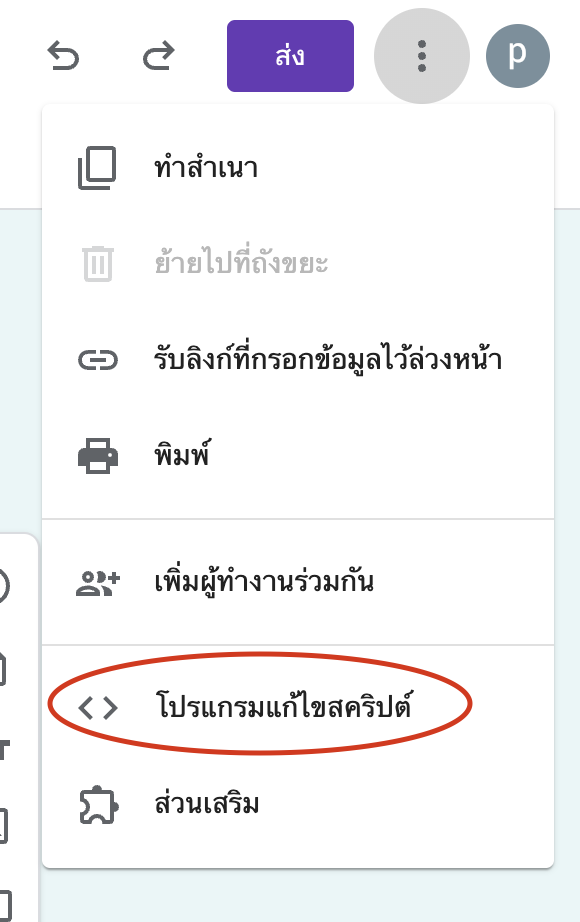
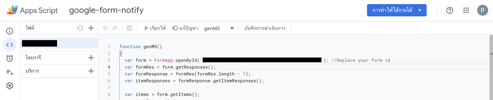

## How to setting this script

----

#### 1. setup your google form

#### 2. select follow the picture below

#### 3. copy script & paste (picture below)

#### 4. edit your google-form id & line notify token

#### 5. add new tricker

----

## Finished :tada::tada::tada:

## Note

- [Line-Notify Document](https://notify-bot.line.me/doc/en/)

